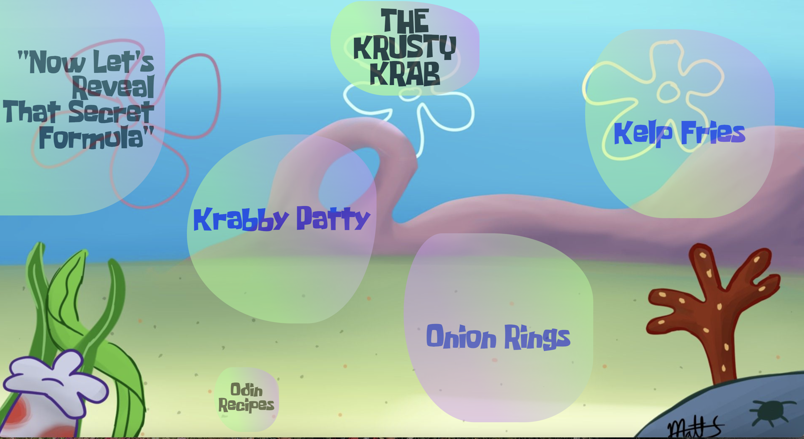

# Odin-Recipes
This is my first project where I got to use a blend of HTML and CSS to create a recipe website. It was really fun letting my creativity 
flow freely and I genunely enjoyed the process :)

Project For The Odin Project

# What I Learned 
  * Create Lists & Paragraphs using HTML
  * Forming Shapes and Aminations using @keyframes property 
  * Creating relative links 
  * Working with / Scaling Background Images using CSS

# Preview

# Demo
🕹 [The Krusty Krab](https://bubblegumloco.github.io/Odin-Recipes/)

